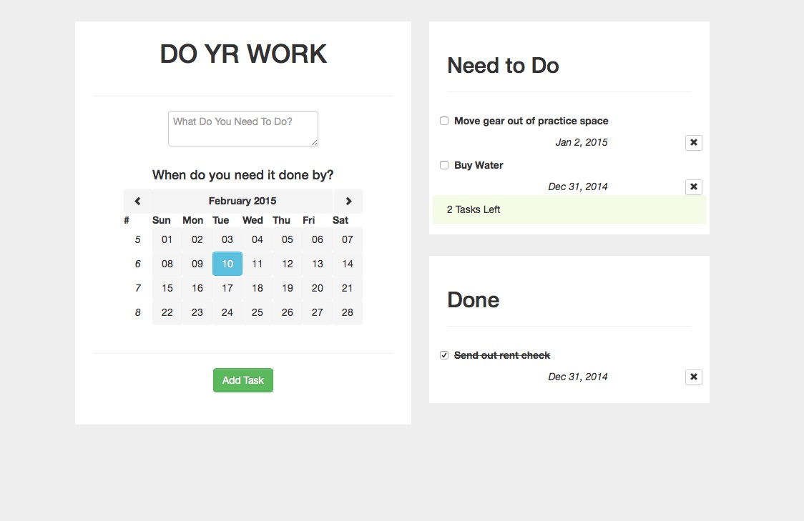

Do YR Work: <a href="https://travis-ci.org/accraze/doYrWork" target="_blank"></a>
===========================================================================================
####Simple productivity app written using a MEAN (MongoDb/Express/AngularJS/Node.js) stack.

Sometimes half of the battle is just getting started. Having the ability to organize your
thoughts and tasks by due date can eliminate the mental chaos of juggling everything at once.




##Try it out:
first make sure you have a mongo instance running:

you can open a seperate terminal and type `mongod`

then in another terminal window:

```bash
git clone https://github.com/accraze/doYrWork.git
cd doYrWork/
npm install && npm start
```
Then navigate to `localhost:3000` and start getting stuff done!

